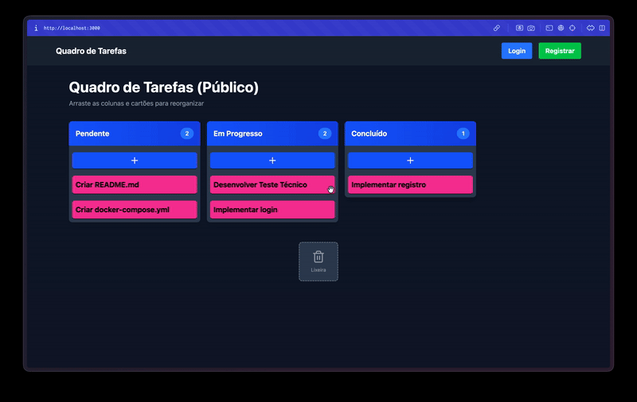
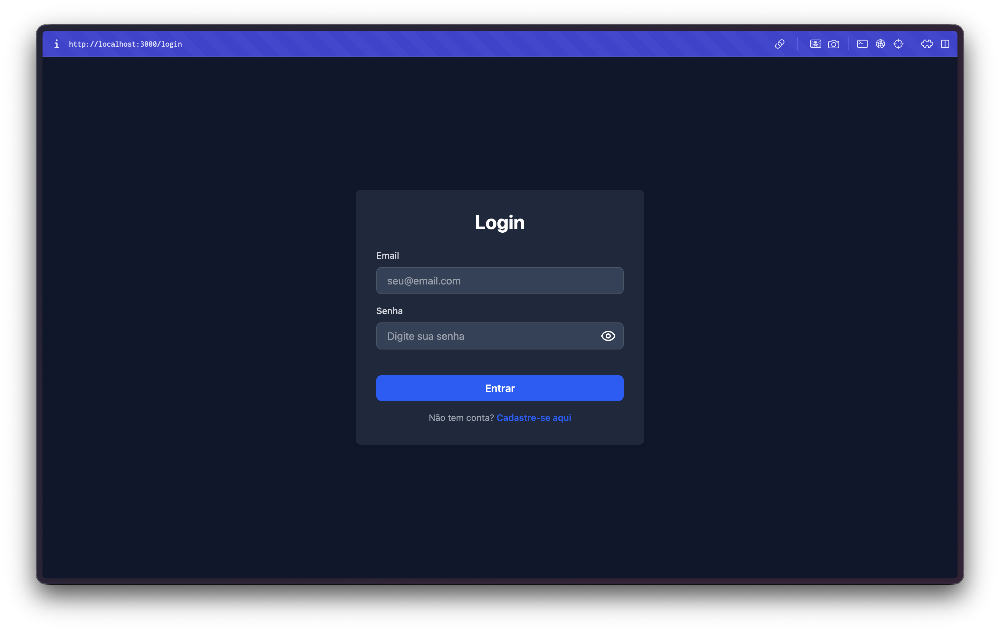
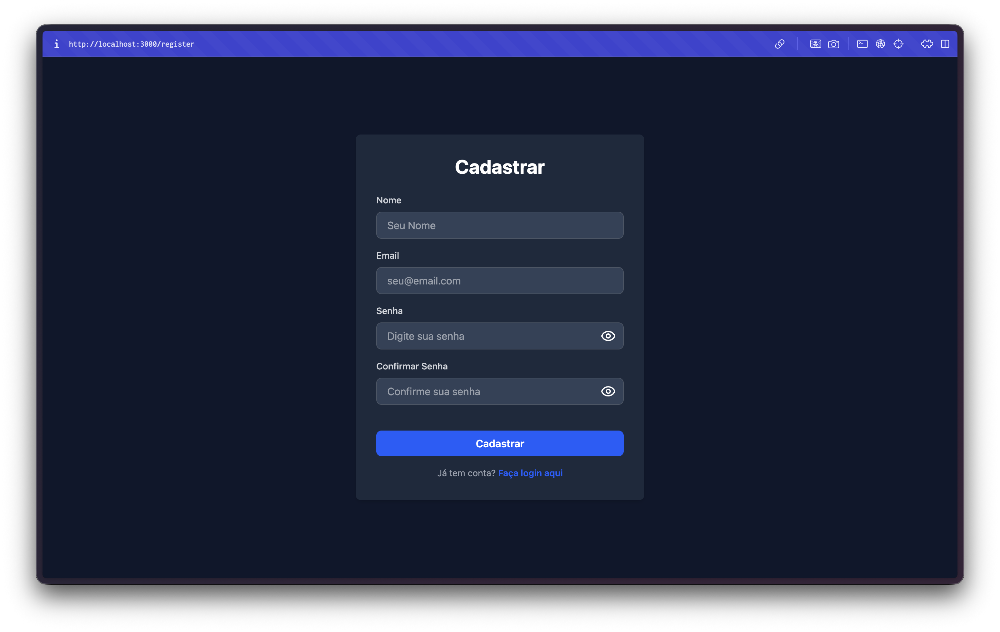
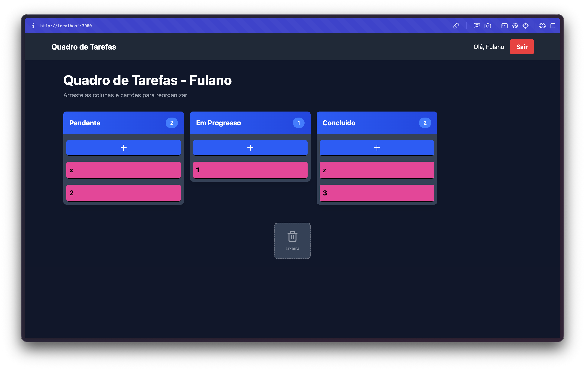

# Projeto Python (FastAPI) + React (Vite)

O sistema e um simples gerenciador de tarefas com autenticação via JWT.

Possui uma área pública de gestão de tarefas (Kanban) e uma área privada de usuário.

<table>
<tr>
<td valign="top">

### Uso do Kanban Público  


### Tela de Login  


</td>
<td valign="top">

### Tela de Registro  


### Uso do Kanban Privado  


</td>
</tr>
</table>

# Como Instalar e Rodar (Docker ou Localmente)

## Requisitos
- Python 3.14+
- Node 20+
- npm

## Estrutura
- `backend/` (Python - FastAPI)
- `frontend/` (React + Vite)

## Rodar com Docker Compose
```bash
docker-compose up -d --build
```

Abra: [http://localhost:3000](http://localhost:3000)

Caso queira parar:
```bash
docker-compose down
```

---

Se preferir rodar localmente sem Docker, siga os passos abaixo.

## Variaveis de ambiente
Crie um arquivo `.env` copiando de `.env.example` na raiz do projeto (mesmo nivel de `backend/` e `frontend/`):

```bash
cp .env.example .env
```

> Observacao: o backend carrega esse `.env` a partir de `backend/routes/*`.

## Rodar o backend (dev)
```bash
cd backend
python -m venv .venv
source .venv/bin/activate
pip install -r requirements.txt
PYTHONPATH=. fastapi run app/main.py --host 0.0.0.0 --port 8000 --reload
```

## Rodar o frontend (dev)
```bash
cd frontend
npm install
npm run dev
```

Abra: [http://localhost:5173](http://localhost:5173) (frontend)
Abra: [http://localhost:8000/docs](http://localhost:8000/docs) (docs do backend)

## Endpoints principais
- `POST /auth/login`
- `POST /auth/register`
- `GET /tasks`
- `POST /tasks`
- `PUT /tasks/{task_id}`
- `DELETE /tasks/{task_id}`

## Observações
- O frontend usa `VITE_API_URL` para apontar o backend.
- O token JWT e guardado em cookie pelo frontend.
- Se estiver logado, o backend retorna apenas tasks do usuario.
